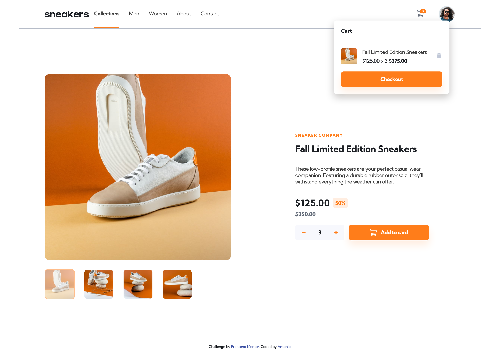

# Frontend Mentor - E-commerce product page solution

This is a solution to the [E-commerce product page challenge on Frontend Mentor](https://www.frontendmentor.io/challenges/ecommerce-product-page-UPsZ9MJp6).

## Table of contents

- [Overview](#overview)
  - [The challenge](#the-challenge)
  - [Screenshot](#screenshot)
  - [Links](#links)
- [My process](#my-process)
  - [Built with](#built-with)
  - [What I learned](#what-i-learned)
  - [Continued development](#continued-development)
  - [Useful resources](#useful-resources)
- [Author](#author)
- [Acknowledgments](#acknowledgments)

## Overview

### The challenge

Users should be able to:

- View the optimal layout for the site depending on their device's screen size
- See hover states for all interactive elements on the page
- Open a lightbox gallery by clicking on the large product image
- Switch the large product image by clicking on the small thumbnail images
- Add items to the cart
- View the cart and remove items from it

### Screenshot





### Links

- Solution URL: [Click here](https://github.com/Antonio0402/ecommerce-product-page-main)
- Live Site URL: [Click here](https://your-live-site-url.com)

## My process

### Built with

- Semantic HTML5 markup with BEM structure
- CSS custom properties
- Flexbox
- CSS Grid
- Mobile-first workflow
- Vanialla JavaScript

### What I learned

- Building a webpage from scratch using CSS custom properties base on the design requirements
- Using bothway <dialog> and customized <div> to styling and making a popup modal
- How to handle checkout button as well as controll the modal content in respect of the amount of product's quantity and price.

```js
function handleCheckOut(e) {
  if(amount === 0) {
    cartContainer.innerHTML = checkOutState.default;
    notif.style.visibility = 'hidden';
  } else {
    cartContainer.innerHTML = checkOutState.items;
    const price = document.getElementById('item__price');
    price.textContent = document.querySelector('.price').textContent;
    const itemAmount = document.getElementById('item__amount');
    itemAmount.textContent = amount;
    const total = document.getElementById('item__total');
    total.textContent = `$${Number.parseInt(document.querySelector('.price').textContent.match(/\d+.*/gi)[0]) * amount}.00`;
    notif.style.visibility = 'visible';
    notifQty.textContent = amount;
  }
}
```
### Continued development

- Expandeding the scale of webpage in direction of completed ecommerce website with multiple product pages and product's cards.
- Create a pop up resgister form and promotion banners for fureture projects.


### Useful resources

- [Dialog - Kevin Powell Youtube channel](https://www.youtube.com/watch?v=TAB_v6yBXIE&t=250s)
- [Evato Tut+ - How To Build a Simple Carousel With Vanilla JavaScript](https://webdesign.tutsplus.com/tutorials/how-to-build-a-simple-carousel-with-vanilla-javascript--cms-41734?_ga=2.233765594.599880800.1667891339-1538490065.1666722410)

## Author

- Frontend Mentor - [@Antonio0402](https://www.frontendmentor.io/profile/Antonio0402)


## Acknowledgments

So much thanks specially to Kevin Powel Youtube Chanel for helping me get through this project as well as being simplified complicated and confusing CSS's topic. Also Envato tut+'s JavaScript courses were to be considerable contributions to my Java Script foundation's since those early days of the project.
